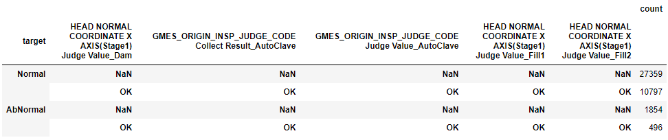

CatBoostClassifier 를 채택했고, Stratified KFold 를 적용했다.
입력 데이터에서 전처리한 과정을 까먹어서 다시 추출해봐야한다.
nunique 1인 데이터만 삭제해봤는데 약 300개 컬럼 날아갔다.
이거 맞냐?

몇몇 컬럼들이 같은 패턴을 보여서 확인해보려고 한다.
통합처리하기전에 모두 동일한지 확인해보자.


'Model.Suffix_Dam','Model.Suffix_AutoClave','Model.Suffix_Fill1','Model.Suffix_Fill2' 컬럼은 전부 같은 값으로 나온다.
그런데 04 번 모델은 어디갔지?


```python
pd.DataFrame(
    train_data[[
        'target',
        'Model.Suffix_Dam',
        'Model.Suffix_AutoClave',
        'Model.Suffix_Fill1',
        'Model.Suffix_Fill2',
    ]].value_counts(dropna=False))
```


다른 그룹도 중복된 값이 나오던데?


```python
pd.DataFrame(
    train_data[[
        'target',
        'HEAD NORMAL COORDINATE X AXIS(Stage1) Judge Value_Dam',
        'GMES_ORIGIN_INSP_JUDGE_CODE Collect Result_AutoClave',
        'GMES_ORIGIN_INSP_JUDGE_CODE Judge Value_AutoClave',
        'HEAD NORMAL COORDINATE X AXIS(Stage1) Judge Value_Fill1',
        'HEAD NORMAL COORDINATE X AXIS(Stage1) Judge Value_Fill2'
]].value_counts(dropna=False))
```

이 컬럼들은 특징은 비슷한데 row 수가 많다.


```python
pd.DataFrame(
    train_data[[
        'target',
        'Workorder_Dam',
        'Workorder_AutoClave',
        'Workorder_Fill1',
        'Workorder_Fill2',
]].value_counts(dropna=False))
```

1180 종류가 나오는데 아래 코드로 보면 663 종류가 나온다.
x2 를 하면 1326 개 성공 실패가 아닌 편파적인 상황이 있다는 거다.
146 workorder 는 하나의 결과만 나온다는 건데 찾아볼 필요가 있다.
이번 컬럼은 성공률을 추가 피처로 등록해보자


```python
pd.DataFrame(
    train_data[[
        'Workorder_Dam',
        'Workorder_AutoClave',
        'Workorder_Fill1',
        'Workorder_Fill2',
]].value_counts(dropna=False))
```


아래 코드로 검증한 결과 하나의 값으로 통일되는 것을 확인했어.

```python
# 모든 행에 대해 각 컬럼의 값이 동일한지 확인
train_data['all_equal'] = (train_data['Workorder_AutoClave'] == train_data['Workorder_Fill1']) & \
                  (train_data['Workorder_Fill1'] == train_data['Workorder_Fill2'])

# 모든 값이 동일한지 여부 확인
all_columns_equal = train_data['all_equal'].all()

print(f"Are all values the same across the three columns? {all_columns_equal}")

```

확인해도 False 라 떠서 컬럼들을 조회해봤어.
```python
# 모든 열이 같은 값을 가지는지 확인
all_equal = train_data[judge_cols].eq(train_data[judge_cols[0]], axis=0).all(axis=1)

# 결과 출력 (각 행에 대해 모든 열이 같은지 여부를 나타내는 부울 시리즈)
print(all_equal)
```

True 인 값들을 비교하니까 Nan 끼리 비교하더라.
이거 그냥 통일했다.
천에 하나의 경우로 nan 이 아닌값이라 불일치한거 찾기에는 너무 비용이 크다.

이번 데이터는 dispenser 가 교차한다면 무조건 `AbNormal` 이 발생한다는 것을 발견할 수 있다.


```python
pd.DataFrame(
    train_data[[
        'target',
        'Equipment_Dam',
        'Equipment_Fill1',
        'Equipment_Fill2',
]].value_counts(dropna=False))
```


대회 공지사항에서는 특정 컬럼에 불순물이 들어갔다고 한다.
데이터를 활용하고 싶은데 고민이다.


```python
pd.DataFrame(
    train_data[[
        'HEAD NORMAL COORDINATE X AXIS(Stage1) Collect Result_Dam',
        'HEAD NORMAL COORDINATE X AXIS(Stage1) Collect Result_Fill1',
        'HEAD NORMAL COORDINATE X AXIS(Stage1) Collect Result_Fill2',
]].value_counts(dropna=False))
```