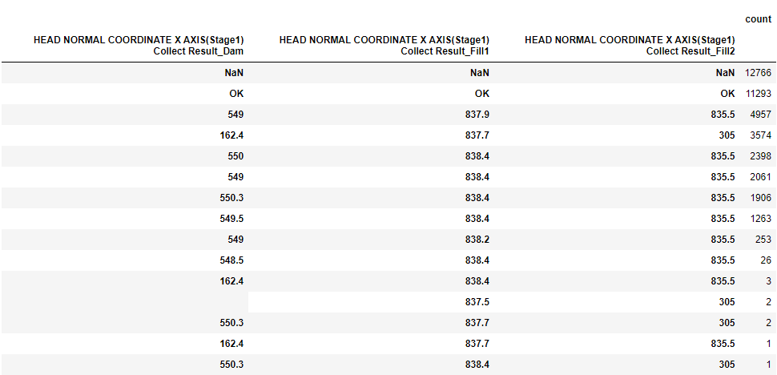

대회 공지사항에서는 특정 컬럼에 불순물이 들어갔다고 한다.
데이터를 활용하고 싶은데 고민이다.


```python
pd.DataFrame(
    train_data[[
        'HEAD NORMAL COORDINATE X AXIS(Stage1) Collect Result_Dam',
        'HEAD NORMAL COORDINATE X AXIS(Stage1) Collect Result_Fill1',
        'HEAD NORMAL COORDINATE X AXIS(Stage1) Collect Result_Fill2',
]].value_counts(dropna=False))
```

데이터를 확인해보니 어떤 검사를 한 위치와 결과값을 나타내는거 같다.
불량 체크를 하기 위해 수집한 데이터인데 무슨 뜻인지는 모르겠다.

Stage 1 의 데이터는 X 좌표가 없기 때문에 데이터로 활용할 수 없다고 생각한다.
하지만 뭐가 성능이 더 좋을지 모르므로 이슈로 등록하자.

# 좌표 데이터 시각화
좌표값을 가지는 데이터가 있어서 시각화 시켜봤다.
아래 글은 클러스터링을 적용한 결과이다.


```python
import matplotlib.pyplot as plt
from mpl_toolkits.mplot3d import Axes3D
from sklearn.cluster import AgglomerativeClustering
from sklearn.preprocessing import StandardScaler
import numpy as np
import pandas as pd

# 가정: train_data는 pandas DataFrame 형태로 주어짐

# 결과를 저장할 데이터프레임 생성
clustered_data = train_data.copy()

def perform_agglomerative_clustering(data, n_clusters=3):
    agg_clustering = AgglomerativeClustering(n_clusters=n_clusters).fit(data)
    return agg_clustering.labels_

def plot_clusters_2d(data, labels, title, ax):
    scatter = ax.scatter(data[:, 0], data[:, 1], c=labels, cmap='viridis', marker='o')
    ax.set_title(title)
    ax.set_xlabel('X Axis')
    ax.set_ylabel('Z Axis')
    # 범례 추가
    legend = ax.legend(*scatter.legend_elements(), title="Clusters")
    ax.add_artist(legend)

def plot_clusters_3d(data, labels, title, ax):
    scatter = ax.scatter(data[:, 0], data[:, 1], data[:, 2], c=labels, cmap='viridis', marker='o')
    ax.set_title(title)
    ax.set_xlabel('X Axis')
    ax.set_ylabel('Y Axis')
    ax.set_zlabel('Z Axis')
    # 범례 추가
    legend = ax.legend(*scatter.legend_elements(), title="Clusters")
    ax.add_artist(legend)

# 스케일러 생성
scaler = StandardScaler()

# 2D 데이터 시각화 (Cure 관련)
fig_2d, axes_2d = plt.subplots(1, 3, figsize=(20, 5))

# 1. Cure Start Position 클러스터링 (2D)
cure_start_x = train_data['CURE START POSITION X Collect Result_Dam'].dropna()
cure_start_z = train_data['CURE START POSITION Z Collect Result_Dam'].dropna()
cure_start_data = np.column_stack((cure_start_x, cure_start_z))
cure_start_data_scaled = scaler.fit_transform(cure_start_data)
cure_start_labels = perform_agglomerative_clustering(cure_start_data_scaled, n_clusters=2)
clustered_data.loc[cure_start_x.index, 'CURE_START_CLUSTER'] = cure_start_labels
plot_clusters_2d(cure_start_data_scaled, cure_start_labels, 'Cure Start Position Clustering (Agglomerative)', axes_2d[0])

# 2. Cure Standby Position 클러스터링 (2D)
cure_standby_x = train_data['CURE STANDBY POSITION X Collect Result_Dam'].dropna()
cure_standby_z = train_data['CURE STANDBY POSITION Z Collect Result_Dam'].dropna()
cure_standby_data = np.column_stack((cure_standby_x, cure_standby_z))
cure_standby_data_scaled = scaler.fit_transform(cure_standby_data)
cure_standby_labels = perform_agglomerative_clustering(cure_standby_data_scaled, n_clusters=1)
clustered_data.loc[cure_standby_x.index, 'CURE_STANDBY_CLUSTER'] = cure_standby_labels
plot_clusters_2d(cure_standby_data_scaled, cure_standby_labels, 'Cure Standby Position Clustering (Agglomerative)', axes_2d[1])

# 3. Cure End Position 클러스터링 (2D)
cure_end_x = train_data['CURE END POSITION X Collect Result_Dam'].dropna()
cure_end_z = train_data['CURE END POSITION Z Collect Result_Dam'].dropna()
cure_end_data = np.column_stack((cure_end_x, cure_end_z))
cure_end_data_scaled = scaler.fit_transform(cure_end_data)
cure_end_labels = perform_agglomerative_clustering(cure_end_data_scaled, n_clusters=2)
clustered_data.loc[cure_end_x.index, 'CURE_END_CLUSTER'] = cure_end_labels
plot_clusters_2d(cure_end_data_scaled, cure_end_labels, 'Cure End Position Clustering (Agglomerative)', axes_2d[2])

plt.tight_layout()
plt.show()
```


```python
# 3D 데이터 시각화 (Head 및 Stage 관련)
fig_3d = plt.figure(figsize=(20, 20))

# 4. Head Standby Position 클러스터링 (3D)
ax1 = fig_3d.add_subplot(3, 3, 1, projection='3d')
head_standby_x = train_data['HEAD Standby Position X Collect Result_Dam'].dropna()
head_standby_y = train_data['HEAD Standby Position Y Collect Result_Dam'].dropna()
head_standby_z = train_data['HEAD Standby Position Z Collect Result_Dam'].dropna()
head_standby_data = np.column_stack((head_standby_x, head_standby_y, head_standby_z))
head_standby_data_scaled = scaler.fit_transform(head_standby_data)
head_standby_labels = perform_agglomerative_clustering(head_standby_data_scaled, n_clusters=3)
clustered_data.loc[head_standby_x.index, 'HEAD_STANDBY_CLUSTER'] = head_standby_labels
plot_clusters_3d(head_standby_data_scaled, head_standby_labels, 'Head Standby Position Clustering (Agglomerative)', ax1)

# 5. Head Clean Position 클러스터링 (3D)
ax2 = fig_3d.add_subplot(3, 3, 2, projection='3d')
head_clean_x = train_data['Head Clean Position X Collect Result_Dam'].dropna()
head_clean_y = train_data['Head Clean Position Y Collect Result_Dam'].dropna()
head_clean_z = train_data['Head Clean Position Z Collect Result_Dam'].dropna()
head_clean_data = np.column_stack((head_clean_x, head_clean_y, head_clean_z))
head_clean_data_scaled = scaler.fit_transform(head_clean_data)
head_clean_labels = perform_agglomerative_clustering(head_clean_data_scaled, n_clusters=2)
clustered_data.loc[head_clean_x.index, 'HEAD_CLEAN_CLUSTER'] = head_clean_labels
plot_clusters_3d(head_clean_data_scaled, head_clean_labels, 'Head Clean Position Clustering (Agglomerative)', ax2)

# 6. Head Purge Position 클러스터링 (3D)
ax3 = fig_3d.add_subplot(3, 3, 3, projection='3d')
head_purge_x = train_data['Head Purge Position X Collect Result_Dam'].dropna()
head_purge_y = train_data['Head Purge Position Y Collect Result_Dam'].dropna()
head_purge_z = train_data['Head Purge Position Z Collect Result_Dam'].dropna()
head_purge_data = np.column_stack((head_purge_x, head_purge_y, head_purge_z))
head_purge_data_scaled = scaler.fit_transform(head_purge_data)
head_purge_labels = perform_agglomerative_clustering(head_purge_data_scaled, n_clusters=2)
clustered_data.loc[head_purge_x.index, 'HEAD_PURGE_CLUSTER'] = head_purge_labels
plot_clusters_3d(head_purge_data_scaled, head_purge_labels, 'Head Purge Position Clustering (Agglomerative)', ax3)

# 7. Head Zero Position 클러스터링 (3D)
ax4 = fig_3d.add_subplot(3, 3, 4, projection='3d')
head_zero_x = train_data['Head Zero Position X Collect Result_Dam'].dropna()
head_zero_y = train_data['Head Zero Position Y Collect Result_Dam'].dropna()
head_zero_z = train_data['Head Zero Position Z Collect Result_Dam'].dropna()
head_zero_data = np.column_stack((head_zero_x, head_zero_y, head_zero_z))
head_zero_data_scaled = scaler.fit_transform(head_zero_data)
head_zero_labels = perform_agglomerative_clustering(head_zero_data_scaled, n_clusters=2)
clustered_data.loc[head_zero_x.index, 'HEAD_ZERO_CLUSTER'] = head_zero_labels
plot_clusters_3d(head_zero_data_scaled, head_zero_labels, 'Head Zero Position Clustering (Agglomerative)', ax4)

# 8. Stage 2 Position 클러스터링 (3D)
ax5 = fig_3d.add_subplot(3, 3, 5, projection='3d')
stage2_x = train_data['HEAD NORMAL COORDINATE X AXIS(Stage2) Collect Result_Dam'].dropna()
stage2_y = train_data['HEAD NORMAL COORDINATE Y AXIS(Stage2) Collect Result_Dam'].dropna()
stage2_z = train_data['HEAD NORMAL COORDINATE Z AXIS(Stage2) Collect Result_Dam'].dropna()
stage2_data = np.column_stack((stage2_x, stage2_y, stage2_z))
stage2_data_scaled = scaler.fit_transform(stage2_data)
stage2_labels = perform_agglomerative_clustering(stage2_data_scaled, n_clusters=6)
clustered_data.loc[stage2_x.index, 'STAGE2_CLUSTER'] = stage2_labels
plot_clusters_3d(stage2_data_scaled, stage2_labels, 'Stage 2 Position Clustering (Agglomerative)', ax5)

# 9. Stage 3 Position 클러스터링 (3D)
ax6 = fig_3d.add_subplot(3, 3, 6, projection='3d')
stage3_x = train_data['HEAD NORMAL COORDINATE X AXIS(Stage3) Collect Result_Dam'].dropna()
stage3_y = train_data['HEAD NORMAL COORDINATE Y AXIS(Stage3) Collect Result_Dam'].dropna()
stage3_z = train_data['HEAD NORMAL COORDINATE Z AXIS(Stage3) Collect Result_Dam'].dropna()
stage3_data = np.column_stack((stage3_x, stage3_y, stage3_z))
stage3_data_scaled = scaler.fit_transform(stage3_data)
stage3_labels = perform_agglomerative_clustering(stage3_data_scaled, n_clusters=5)
clustered_data.loc[stage3_x.index, 'STAGE3_CLUSTER'] = stage3_labels
plot_clusters_3d(stage3_data_scaled, stage3_labels, 'Stage 3 Position Clustering (Agglomerative)', ax6)

plt.tight_layout()
plt.show()
```


# 거리 데이터 추가
Cure, Head, Stage 는 단계를 가지고 있다.
그래서 거리를 추가해보았다.

# 학습 결과
데이터 학습해서 제출했더니 0.12 정도 나왔는데, 대충 짠거는 0.19 나오는데 이거 차이가 너무 크다.
train 데이터로 비교했을 때 차이는 없어보였는데, 문제가 있는거 같다.
일단 RFE 로 피처 선택해놨으니까 이걸로 지켜보자.

