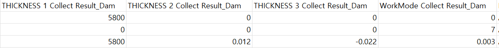

# train.csv 분석 내용

서로 다른 데이터 병합 과정에서 이음새 컬럼들이 문제가 있었다.

위 사진처럼 `THICKNESS 1 Collect Result_Dam` 컬럼은 우측의 2, 3 컬럼보다는 좌측의 컬럼값과 유사하다.

맨 우측의 `WorkMode Collect Result_Dam` 컬럼은 본래 값을 가지면서도 값의 침범으로 일부 데이터가 훼손된 모습을 보인다.

같은 종류의 컬럼이라면 일관성을 보일 것이라 가정하면, 해당 컬럼들은 조치가 필요해 보인다.

이를 바탕으로 데이터를 살펴보면서 부자연스러운 컬럼을 찾아보려고 한다.

# 데이터 접합부 찾기

`Equipment_Dam` 부터 `Dispense Volume(Stage3) Collect Result_Dam` 까지는 정상
`HEAD NORMAL COORDINATE X AXIS(Stage1) Collect Result_Dam` 컬럼과 `HEAD NORMAL COORDINATE X AXIS(Stage1) Judge Value_Dam` 컬럼은 이어지면서 문제가 발생함

`HEAD NORMAL COORDINATE X AXIS(Stage2) Collect Result_Dam` 부터 `Receip No Collect Result_Dam` 까지 정상

`Stage1 Circle1 Distance Speed Collect Result_Dam` 컬럼은 같은 `Circle` 군에서 다른 값들을 가짐 `1 ~ 17` 까지의 값을 가지고 있음.
이 값은 `WorkMode` 컬럼에서 다루는 값들이라 의심됨.

`Stage1 Circle2 Distance Speed Collect Result_Dam` 부터 `Stage3 Line4 Distance Speed Collect Result_Dam` 까지 정상

`THICKNESS 1 Collect Result_Dam` 부터 `WorkMode Collect Result_Dam` 까지는 데이터가 혼재되어 있음. 덮어쓰기 되었거나 밀려쓰인 경우로 생각됨.

`Model.Suffix_AutoClave` 부터 `Chamber Temp. Judge Value_AutoClave` 까지 정상

`GMES_ORIGIN_INSP_JUDGE_CODE Collect Result_AutoClave` 와 `GMES_ORIGIN_INSP_JUDGE_CODE Judge Value_AutoClave` 컬럼은 병합과정에서 소실된것으로 추정

`Equipment_Fill1` 부터 `Dispense Volume(Stage3) Collect Result_Fill1` 정상

`HEAD NORMAL COORDINATE X AXIS(Stage1) Collect Result_Fill1` 와
`HEAD NORMAL COORDINATE X AXIS(Stage1) Judge Value_Fill1` 데이터 혼재

`HEAD NORMAL COORDINATE X AXIS(Stage2) Collect Result_Fill1` 부터
`CURE START POSITION Z Collect Result_Fill2` 까지 정상

`HEAD NORMAL COORDINATE X AXIS(Stage1) Collect Result_Fill2	HEAD NORMAL` 와 `COORDINATE X AXIS(Stage1) Judge Value_Fill2` 혼재

`HEAD NORMAL COORDINATE X AXIS(Stage2) Collect Result_Fill2` 부터 `WorkMode Collect Result_Fill2` 까지 정상

# class_weight 설정결과

이상치에 대한 가중치를 설정한 결과가 threshold 를 적용했을때 신뢰성이 높았다.
